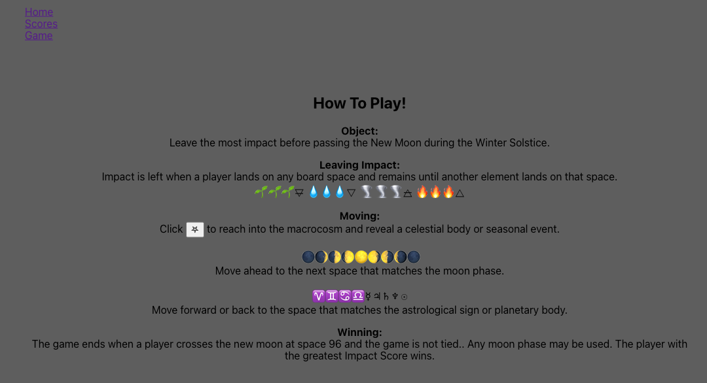
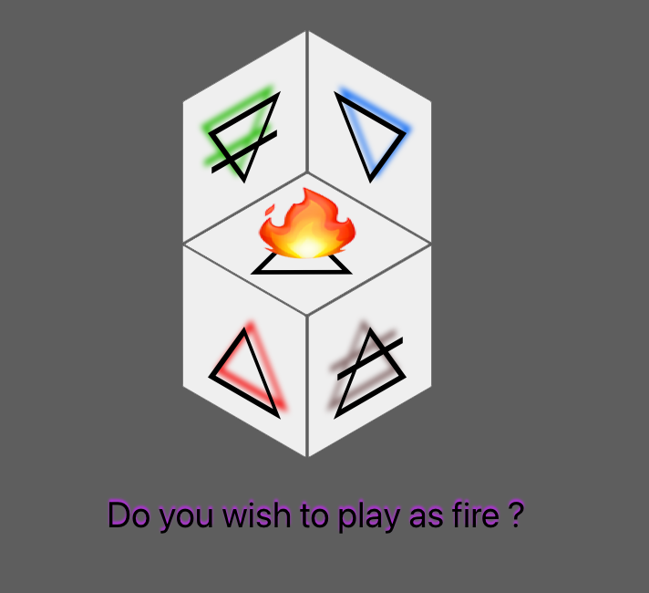
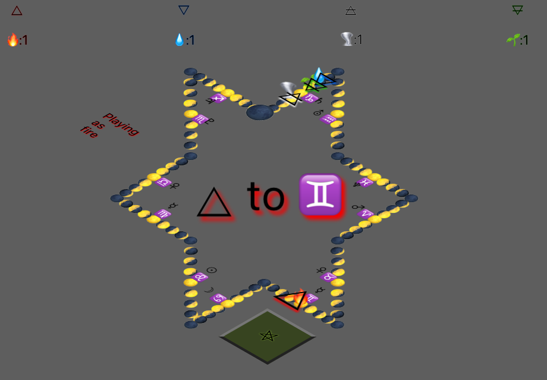
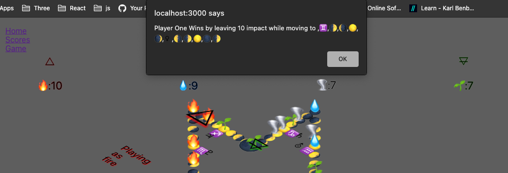
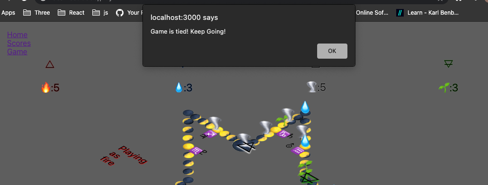

# Pagan Emoji Land
A gaming application where the object is to leave the most impact on an astral path made up entirely of emojis. 

Players (classical elements: 🜂,🜃,🜄,🜁), take turns drawing or summoing from a pool of symbols and then moving to the matching board space. 
    For example, summoning a 🌕 would move one's player to the next closest full moon, moving clockwise around the path. 
Once a player lands on a space, they leave an impact symbal, increasing their score by 1. 
    For example, fire (🜂) would leave a flame emoji (🔥) on top of that space, lasting until another player lands there.

If an astrological sign (♋) or planetary body (♃) is summoned, the player moves directly to the matching board space.

When a player crosses the last space (circumnavagates the map) the player with the most impact symbols on the board wins. 

If tie-game, the game continues until another player completes a revolution or summons are exhausted. 

When the game is won by the user, the symbol, score, and moves list will persist in the scores api. The scores are visible via the /games route or by clicking the Scores button on the nav bar. 

# Installation and Setup Instructions

    Frontend set up:
        Clone down this repository. 
        Within the frontend directory run 'npm install && npm start'.
        Open http://localhost:3000 to view it in the browser.

    Backend set up:
        Clone down https://github.com/kbenbeneck/pagan-emoji-land-impact-scores-api 
        Within the backend directory, bundle install. 
        Start rails server on port 3001 with 'rails s -p 3001'
        If you'd like to view persisted data as JSON,
        Open http://localhost:3001/games to view it in the browser.

# Ready To Play:
    Inside the frontend browser, click Game in the nav bar.
    Choose your player by clicking an elemental symbol.
    Start the game by clicking on the now visible, impact symbol button. 
    Click the summon button (𖤐) and each player will take turns moving and leaving an impact.  

This project was bootstrapped with [Create React App](https://github.com/facebook/create-react-app).
